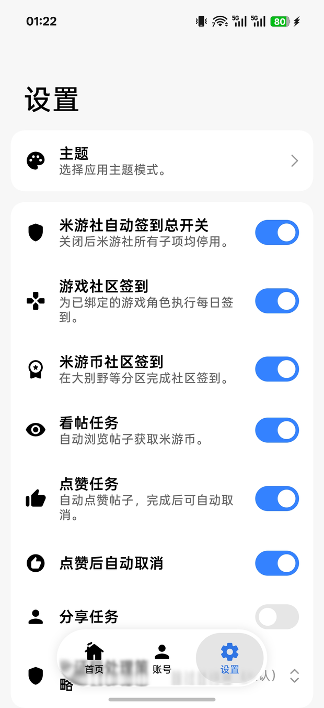

# Fewards

**Android 自动签到**：米游社（游戏签到 + 米游币任务）与 WorkBuddy（每日积分），一次点击跑完全部。

[](https://github.com/functy23/fewards/actions/workflows/test.yml)
[](https://github.com/functy23/fewards/releases/latest)

Kotlin + Jetpack Compose，界面全程 **Miuix**（HyperOS 风格）。

<p align="center">
  
  
  
  
</p>
<p align="center">
  <sub>首页 · 账号 · 设置 · 主题</sub>
</p>

## 下载

到 [Releases](https://github.com/functy23/fewards/releases/latest) 下载最新 `Fewards-<版本>-release.apk`（release + R8）。

## 能做什么

| | |
|---|---|
| **米游社** | 扫码登录（stoken v2）或 Cookie；原神 / 星铁 / 绝区零每日签到；米游币任务（社区签到 / 看帖 / 点赞 / 分享）；验证码策略（默认跳过，可选打码接口） |
| **WorkBuddy** | 微信 / QQ 扫码授权或粘贴桌面端 accessToken；每日积分自动签到 |

- **多账号** — 米游社与 WorkBuddy 都支持多个账号，同一账号重复授权按 uid 更新而非新增
- **一条链路** — 首页「开始执行」与控制中心「签到」磁贴走同一套流程，执行中实时进度通知
- **后台可续** — 执行走 WorkManager，进程被杀后仍能跑完
- **本地优先** — 凭据只存本机 SharedPreferences，日志不打印 token / cookie

## 使用

1. **账号** — 右上角「+」添加：米游社扫码或粘贴含 stoken + mid 的 Cookie；WorkBuddy 用微信 / QQ 扫码授权，或粘贴桌面端 accessToken
2. **设置** — 开关任务分项、验证码策略、通知与完成总览
3. **首页** — 勾选任务 → 开始执行

macOS 想直接取桌面端 token：

```bash
chmod +x scripts/workbuddy-token.sh
./scripts/workbuddy-token.sh
```

## 构建

给用户装的包必须是 **release + R8**：

```bash
./gradlew :app:assembleRelease
# 产物：app/build/outputs/apk/release/app-release.apk
```

测试：`./gradlew :app:testDebugUnitTest`

工具链：AGP 9.4.0 / Kotlin 2.4.10 / Compose BOM 2026.08.00 / miuix 0.9.3 / miuix-nav 0.9.4-rc01 / minSdk 31 / target 37 / Java 21。

## 架构

```
app/src/main/java/com/functy/fewards/
├── core/mihoyo/          # DS 签名、常量、HTTP、引擎
├── core/workbuddy/       # 签到引擎、扫码授权协议
├── data/repository/      # 设置、账号、配置导入导出
├── ui/screen/            # 主页 / 账号 / 设置 / 主题 / 关于（Miuix）
├── ui/viewmodel/
└── work/                 # WorkManager worker、通知
```

Agent 约定见 [AGENTS.md](AGENTS.md)。

## 接口与参考

- 米游社 DS salt、act_id、地址以 [MiyoQian](https://github.com/Womsxd/MiyoQian) 为准，抓包后可改 `DsSign.kt` / `MihoyoConstants.kt`；stoken 换 cookie 走 `getCookieAccountInfoBySToken`
- WorkBuddy 签到：`copilot.tencent.com/billing/meter/*`
- WorkBuddy 扫码授权：`copilot.tencent.com/v2/plugin/auth/state|token` + `/v2/plugin/login/account`（`platform=CLI`；未扫码返回非 0 码，属正常等待）
- 打码接口：POST `{gt, challenge}` → `{validate}`
- UI 参考 [KernelSU manager](https://github.com/tiann/KernelSU) 与 [InstallerX Revived](https://github.com/wxxsfxyzm/InstallerX-Revived)

早期同功能仓库已归档，请只用本仓库：[autofewards](https://github.com/functy23/autofewards)、[autorewards-runner](https://github.com/functy23/autorewards-runner)（Flutter 母本）。

## 免责声明

仅供学习交流，遵守各平台条款；账号风险自负。
