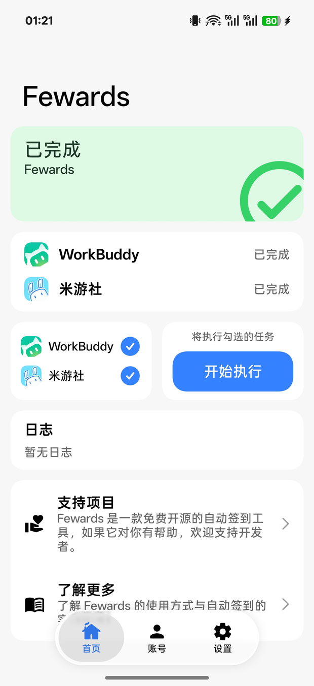
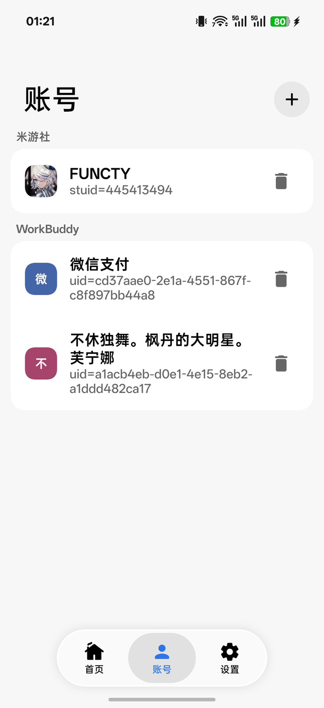
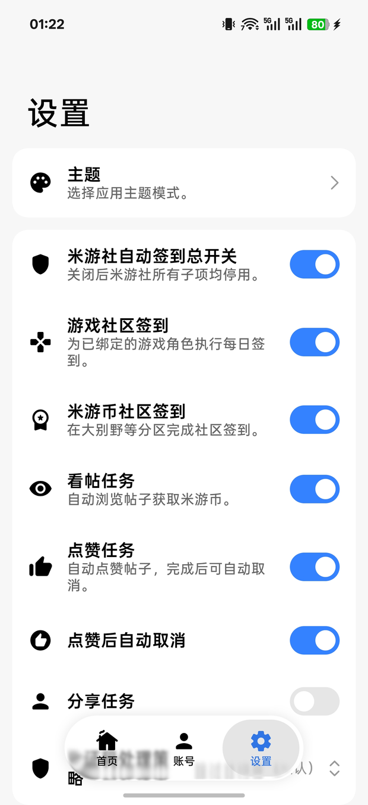
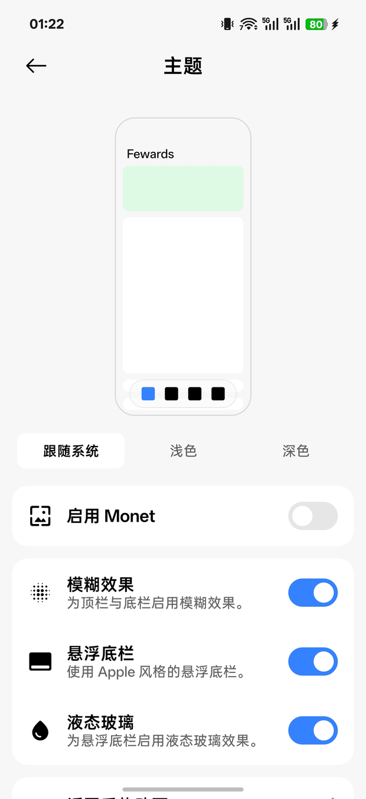
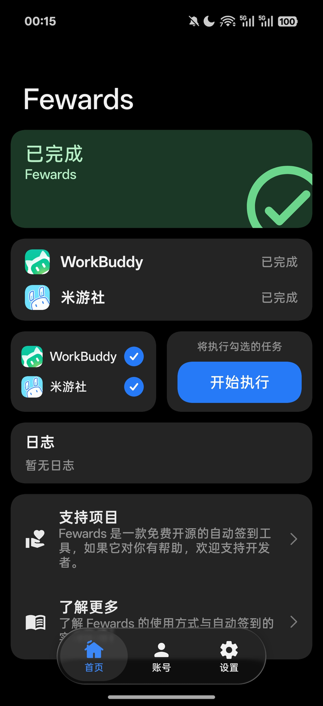
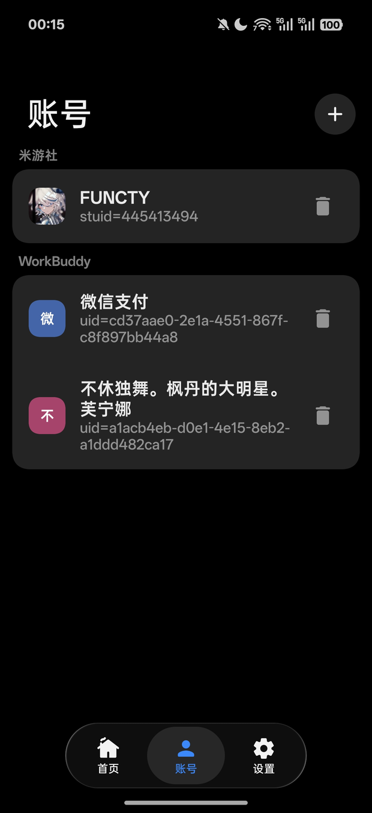
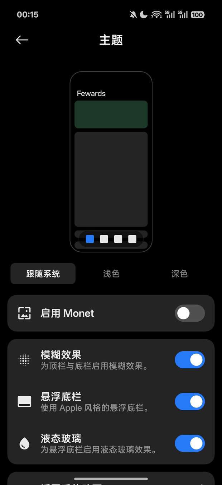

<div align="center">

# 🎁 Fewards

**Android auto check-in for HoYoLAB (米游社) and WorkBuddy — one tap runs every daily task.**

[](https://github.com/functy23/fewards)
[](https://kotlinlang.org/)
[](https://github.com/functy23/fewards)
[](https://github.com/functy23/fewards)

[](https://github.com/functy23/fewards/actions/workflows/test.yml)

[](https://github.com/functy23/fewards/releases/latest)
[](https://github.com/functy23/fewards/releases)
[](https://github.com/functy23/fewards/stargazers)
[](https://github.com/functy23/fewards)
[](https://github.com/functy23/fewards/graphs/contributors)

[Issues](https://github.com/functy23/fewards/issues) • [AGENTS.md](AGENTS.md) • [Releases](https://github.com/functy23/fewards/releases)

**English** | [简体中文](doc/README_zh-CN.md)
</div>

---

Kotlin + Jetpack Compose, with a **Miuix** UI throughout (HyperOS style).

<p align="center">
  
  
  
  
</p>
<p align="center">
  <sub>Light · Home · Accounts · Settings · Theme</sub>
</p>

<p align="center">
  
  
  
  
</p>
<p align="center">
  <sub>Dark · Home · Accounts · Settings · Theme</sub>
</p>

## Download

Download the latest `Fewards-<version>-release.apk` (release + R8) from [Releases](https://github.com/functy23/fewards/releases/latest).

## What it can do

| | |
|---|---|
| **HoYoLAB (米游社)** | QR-code login (stoken v2) or Cookie; daily check-in for Genshin Impact / Honkai: Star Rail / Zenless Zone Zero; 米游币 (Miyoushe Coin) tasks (community check-in / read posts / like / share); CAPTCHA strategy (skipped by default, optional captcha-solving API) |
| **WorkBuddy** | WeChat / QQ QR-code authorization, or paste the desktop accessToken; automatic daily points check-in |

- **Multiple accounts** — both HoYoLAB (米游社) and WorkBuddy support several accounts; re-authorizing the same account updates it by uid instead of adding a new one
- **One pipeline** — the home screen's "Start" button and the Control Center "check-in" tile run the same flow, with live progress notifications while it runs
- **Keeps running in the background** — execution goes through WorkManager, so it still finishes after the process is killed
- **Local-first** — credentials are stored only in the device's own SharedPreferences, and logs never print tokens / cookies

## Usage

1. **Accounts** — add one with "+" in the top-right corner: scan the QR code for HoYoLAB (米游社), or paste a Cookie containing stoken + mid; for WorkBuddy, authorize by scanning with WeChat / QQ, or paste the desktop accessToken
2. **Settings** — toggle individual tasks, the CAPTCHA strategy, notifications and the completion overview
3. **Home** — tick the tasks → Start

On macOS, to grab the desktop token directly:

```bash
chmod +x scripts/workbuddy-token.sh
./scripts/workbuddy-token.sh
```

## Build

The package you ship to users must be **release + R8**:

```bash
./gradlew :app:assembleRelease
# Output: app/build/outputs/apk/release/app-release.apk
```

Tests: `./gradlew :app:testDebugUnitTest`

Toolchain: AGP 9.4.0 / Kotlin 2.4.10 / Compose BOM 2026.08.00 / miuix 0.9.4 / miuix-nav 0.9.4 / minSdk 31 / target 37 / Java 21.

## Architecture

```
app/src/main/java/com/functy/fewards/
├── core/mihoyo/          # DS signing, constants, HTTP, engine
├── core/workbuddy/       # check-in engine, QR authorization protocol
├── data/repository/      # settings, accounts, config import/export
├── ui/screen/            # home / accounts / settings / theme / about (Miuix)
├── ui/viewmodel/
└── work/                 # WorkManager workers, notifications
```

Agent conventions live in [AGENTS.md](AGENTS.md).

## APIs and references

- HoYoLAB (米游社) DS salt, act_id and endpoints follow [MiyoQian](https://github.com/Womsxd/MiyoQian); after sniffing traffic you can edit `DsSign.kt` / `MihoyoConstants.kt`; the stoken → cookie exchange goes through `getCookieAccountInfoBySToken`
- WorkBuddy check-in: `copilot.tencent.com/billing/meter/*`
- WorkBuddy QR authorization: `copilot.tencent.com/v2/plugin/auth/state|token` + `/v2/plugin/login/account` (`platform=CLI`; a non-zero code before the QR code is scanned is the normal waiting state)
- Captcha-solving API: POST `{gt, challenge}` → `{validate}`
- UI references: [KernelSU manager](https://github.com/tiann/KernelSU) and [InstallerX Revived](https://github.com/wxxsfxyzm/InstallerX-Revived)

Earlier repositories with the same functionality are archived — use only this one: [autofewards](https://github.com/functy23/autofewards), [autorewards-runner](https://github.com/functy23/autorewards-runner) (the Flutter original).

## Disclaimer

For learning and study only; comply with each platform's terms; you bear the account risk yourself.
